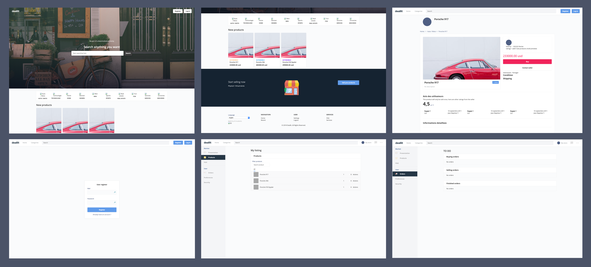

# Deallit: Your decentralised ecommerce

> A social platform where you can create your own store and sell products using cryptocurrencies.




This project was made when I was learning about *frontend / backend / bitcoin* back in *january 2018*. It contains fake passwords, API keys and emtpy bitcoin addresses.

The technologies used are

- **Backend**: NodeJS / MySQL / Redis / Bitcoind (bitcoin-core) / ZeroMQ (bitcoin-core events) / Mocha testing / Password authentication

- **Frontend**: VueJS, Less, Webpack

- **Services**: AWS (S3, EC2, Lambda, RDS, ELB, Cloudfront, WAF) / Sendgrid / Namecheap / Cloudflare / Letsecrypt SSL

- **Design**: Sketch

## Folder structure

```bash
/api # Backend main service
/client-web # Web app
/db # MySQL init
/setup # Useful commands and instructions
```

## Starting guide

*Since I was stupid at the time, most of the assets were saved only on CDN. Because of that some assets might not work today*

```
# One line start
docker-compose up # Use -d to run in background
```

The client is listening by default on `localhost:8080`.

Development credentials: `test2@test.com:test`.

---

## Usefull commands

### Docker

```bash
docker-compose up -d # Start every services
docker-compose down # Stop every services

docker logs -f PS_ID
docker attach PS_ID
docker exec -it PS_ID "..." # /bin/sh to start new terminal

# Delete all ps / images
docker rm $(docker ps -aq)
docker rmi $(docker images -qa)
```

### Production

**Build**

```bash
sh build-prod.sh
# or
sh build-prod.sh api
```

**Deploy commands**

```bash
# Start
docker swarm init # --listen-addr $(docker-machine ip node-1):2377
docker stack deploy -c docker-compose-prod.yml --with-registry-auth STACK_NAME

# Stop
docker stack rm STACK_NAME
docker swarm leave --force

docker service ls
docker service ps SERVICE_NAME
docker service scale SERVICE_NAME=5

docker node ls # on swarm host

# Manage
docker-machine create --driver none --url=tcp://50.134.234.20:2376 CUSTOM_HW

# Tests (virtual machine requires Oracle VirtualBox)
docker-machine create --driver virtualbox master/worker-1
docker-machine ssh myvm1 "docker swarm init --advertise-addr <myvm1 ip>"

eval $(docker-machine env MANAGER_NODE) # be the manager
```
